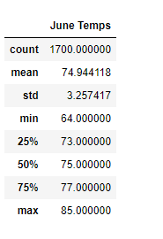
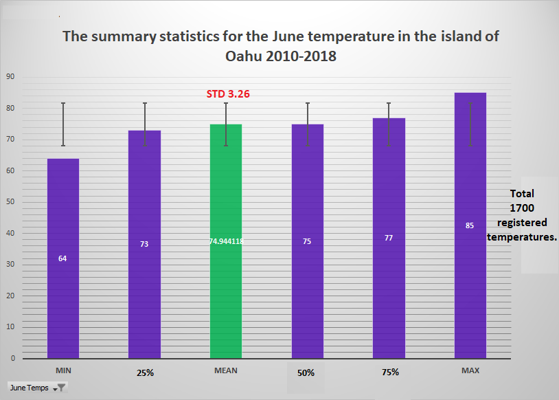
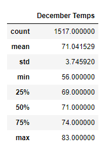
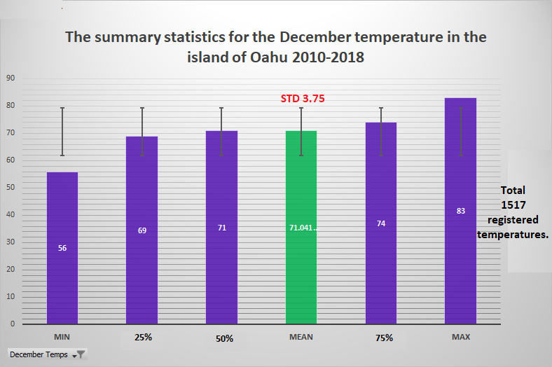

# surfs_up
## Overview of Analysis:
As part of the idea to open a surf shop that also serves ice cream on the beautiful island of Oahu. We have a developed a business case and made a market study to pitch our idea to investors. Catching the attention of one investor, W. Avy, his is concern was information regarding the weather. He provides us with a weather data set and asks us to run some analysis on it and provide him some feedback. We are presenting our weather analysis to him to show temperature trends during summer and winter months, specifically June and December.

## Results:
### Temperature Statistics ###
The provided data set had temperature and precipitation measurements from 9 different stations from 2010 thru 2018. We used Python and SQLite to analyze and filter it to show statistics for the months June and December during the timeframe.
### Fig 1. Summary statistics for the June temperatures. 
 
### Fig 1.1. Graphic summary statistics for the June temperatures. 
 

### Fig 2. Summary statistics for the December temperatures. 
 
### Fig 2.1. Graphic summary statistics for the December temperatures. 
 
  
* 	The average temperature for June (74.9°F) and December(71°F) above 70°F between 2010-2018, similar averages indicate the temperatures in Oahu stay relatively steady in the 70's year-round.

* 	The standard deviation is 3.26 for June and 3.75 for December, considering this information we can say that the temperature could vary by 4 degrees above or below the expected temperature.

* 	 The temperature min registered for June is 64.0°F and to December is 56.0°F this means June's lows still provide good surfing and ice cream weather.

* 	The June 75th percentile is 77°F  and for  December 75th percentile is 74°F Indicates 75% of the time the temperature is in the middle to upper 70's.

## Summary:
Additional analysis could help solidify the business case considering the precipitation.
*	Query to view precipitation statistics during June and December.

    o	This would show the relationship between temperatures and precipitation
*	Query to view average temperatures and precipitation levels at different stations.

    o	This could help narrow down the optimal location for the shop.
